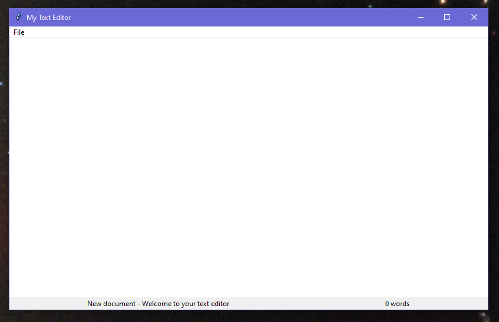
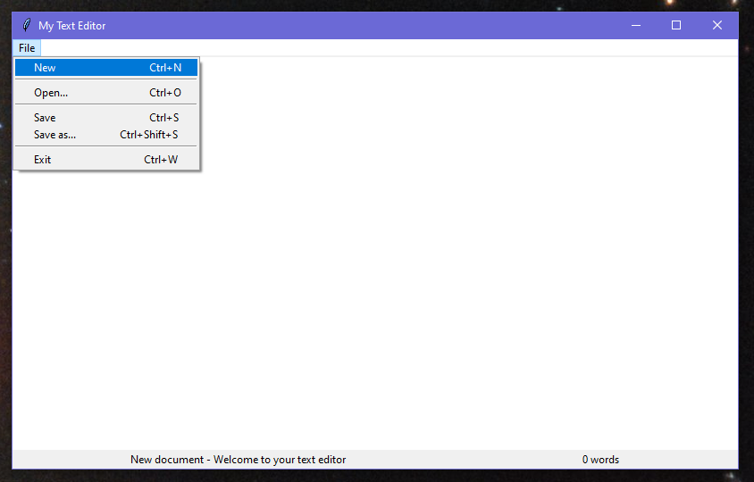
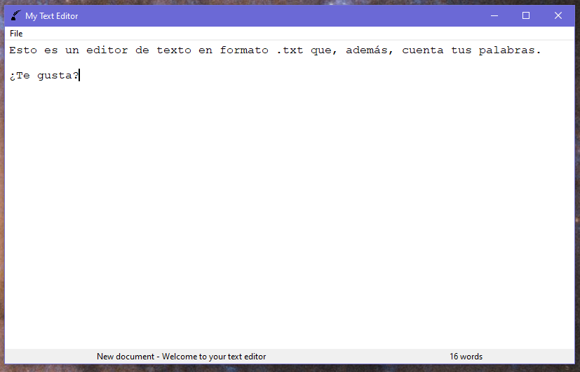

# My Text Editor
A minimalist text editor made using Python and Tkinter.





It has a few useful functions as:


- Open a new file.

  ```python
  def new():
      global path
      message.set('New document - Welcome to your text editor')
      path = ''
      text.delete(1.0, 'end')
  ```

  

- Open a file that exists.

  

- Save a file that has been saved before or save a new one.

  ```python
  def save():
      message.set('Saving file')
      if path != '':
          content = text.get(1.0, 'end-1c')
          file = open(path, 'w+')
          file.write(content)
          file.close()
          message.set('File successfully saved - Welcome to your text editor')
      else:
          save_as()
  ```

  

- Shortcuts functionality.

  

  

  

  ------

  

  I hope you like My Text Editor!

  

  